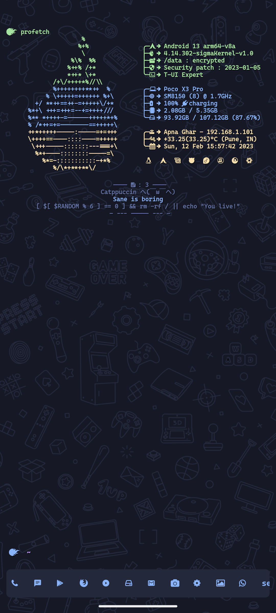
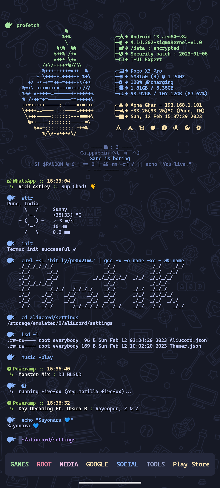

# ProCatppuccin

***A vibrant charmy theme for [`T-UI`](http://github.com/Andre1299/TUI-ConsoleLauncher)***

# Installation

0) backup your theme (optional) I suggest making a backup of your all files. To do this, copy and paste somewhere the entire `T-UI` folder that you find in the root of the internal storage (`/storage/emulated/0/t-ui`).

1) Download the `zip` file from the release page.

2) Unzip the theme file.

3) Copy the `t-ui` folder to the root of the internal storage (`/storage/emulated/0/t-ui`)

4) Go back to `T-UI` and run :: `patchfetch`

5) Run :: `restart`

***Voilà !!!*** Enjoy your new theme
